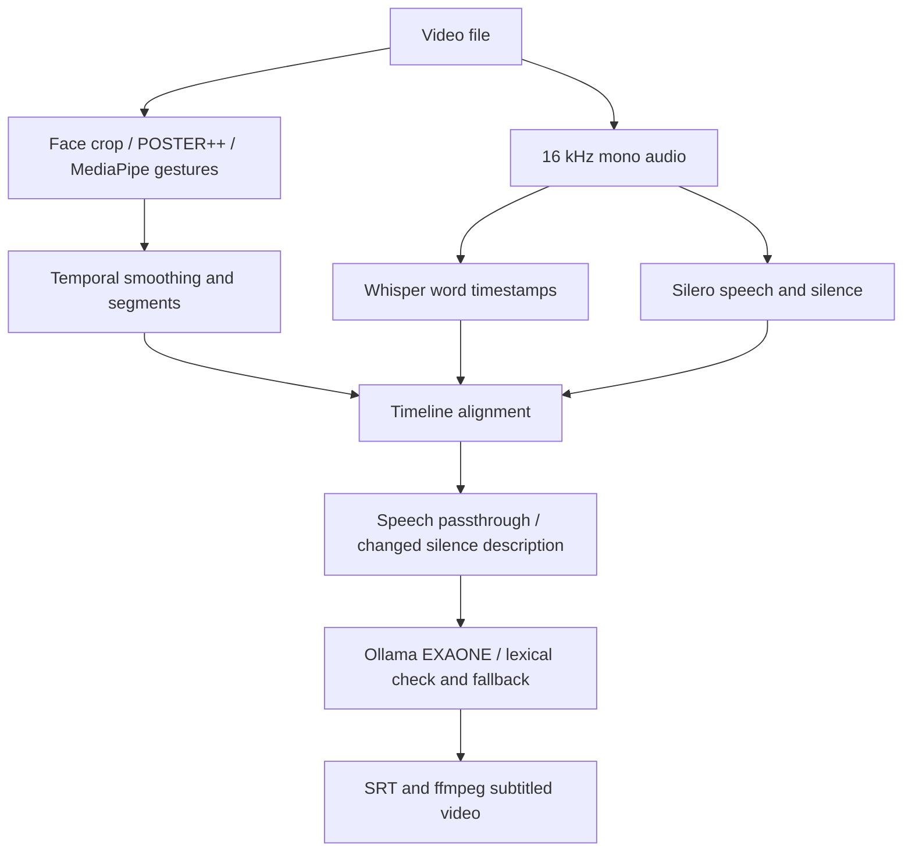

# 논문 자료 안내

## 연구 방향과 이력

MIPA는 웹캠 표정·동작 인식과 침묵 신호를 활용한 대화 트리거의 초기 구현입니다. 후속 `vad-gen/PLAN.md`는 단일 인물 영상의 표정·제스처·발화/침묵을 시간축으로 결합하여 영어 화면해설 자막과 데모 영상을 만드는 연구를 설명합니다. 이 두 작업을 동일한 완성 시스템으로 혼합해 기술하지 않습니다. 이번 논문의 최종 대상은 사용자 확인이 필요합니다.

연구일지에는 2026-08-03~07 KCI 초안 작성·수정 기록이 있지만 해당 초안 파일은 이번 검색에서 발견되지 않았습니다. 공유 Claude 대화에는 첨부파일이 숨겨져 있으므로 교수님과의 대화 원문이나 첨부 코드를 모두 복원했다고 볼 수 없습니다.

## 논문 각 장과 근거 자료

| 논문 항목 | 사용할 파일 | 작성 가능 범위 / 추가 자료 |
|---|---|---|
| 서론·목적 | `code/vad-gen/PLAN.md` | 기존 계획에 근거한 목적. 선행연구의 공백·최초성은 별도 문헌조사 필요 |
| 관련 연구 | `references/README.md`, POSTER 원본 README | 모델·데이터 출처. AD 관련 선행연구 비교는 추가 필요 |
| 시스템 구조 | `code/vad-gen/test_export.py`, `src/*` | 실제 호출 경로와 데이터 흐름 |
| 영상 인식 | `src/vision/poster_infer.py`, `gesture.py` | 7종 표정, MediaPipe 기반 기하 규칙. 감정의 실제 내적 상태 측정으로 해석하지 않음 |
| 음성 분석 | `src/audio/audio_analysis.py` | 영어 STT, VAD, 16kHz 모노, 침묵 임계값 |
| 시간축 통합 | `src/align/segment.py`, `timeline.py` | 스무딩·구간 병합·겹침 길이 기반 결합 |
| 해설 생성 | `src/generate/describe.py` | 프롬프트, 상태 변화 기준, 금칙어 검사·대체 문장 |
| 결과 예시 | `local_materials/vad-gen/outputs/*.srt`, `*.mp4` | 기존 산출물 예시. 개별 사례를 일반 성능으로 확대하지 않음 |
| 수행 근거 | `local_materials/vad-gen/outputs/seamless_candidate_1.log` | SRT·자막 영상 저장까지 기록된 과거 실행 로그 |
| 정량 평가 | `exp_ravdess.py`, `exp_silence_accuracy.py`, `test_emotion_dataset.py` | 실험 코드 존재. 최종 정량 결과와 원시 예측은 미확보 |
| 구현 환경 | `environment/*` | 현재 관측 환경. 과거 실험 환경과 구분 |
| 한계·결론 | `IMPLEMENTATION.md`, `EXPERIMENTS.md` | 확인된 제한·추가 검증 계획 |

## 그림·표 작성 재료

- 그림 1: 아래 실제 vad-gen 파이프라인. 논문 제출용으로 별도 벡터 그림 제작 가능.
- 그림 2: 기존 SRT 및 데모의 같은 시점 프레임과 대응 문장. 프레임 시간·입력 식별자·출처 명시.
- 표 1: 모듈·버전·파라미터 (`IMPLEMENTATION.md`, `environment/installed_packages.json`).
- 표 2: 실험 데이터의 클립 수·인물 수·분할·선택 기준. 파일 수와 실제 평가 수는 다름.
- 표 3: 평가 결과 (`EXPERIMENTS.md`의 헤더 양식). 미실시 항목은 빈칸 유지.
- 표 4: 실패 사례. 얼굴 검출 실패, 감정 오인식, 자막 오류, LLM 대체 문장 발생 등을 실제 사례와 연결.

## 원본 확보가 필요한 자료

논문 HWP/HWPX/DOCX/PDF, 교수님 수정사항, 원시 실험 로그·CSV, 정답 주석, 사용한 클립의 출처와 선택 기준, 최종 그림·표, 발표자료가 남아 있으면 추가해야 합니다. `local_materials/투고논문양식.hwp`는 찾은 양식 원본이며 최신 학회 지침과 내용 일치 여부는 확인하지 않았습니다.
